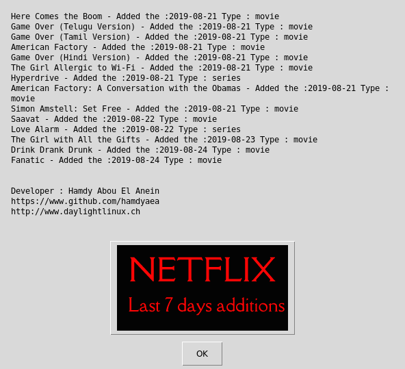

   

# Mars InSight Lastest Weather Report



## What's this software ?  

This python 3 software load from the Netflix database the last seven days additions for your country.

The data is downloaded from : https://rapidapi.com/unogs/api/unogs/details

If you use it from this Python 3 file you will need to subscribe (it's free) to this API.
If you use the compiled version from Sourceforge you don't need to subscribe.

## Download the Windows .exe version :

You can run it with Python 3 and the right libraries or for Windows you can use the .exe software that I created there :

[](https://sourceforge.net/projects/mars-insight-weather-live/files/latest/download)
[](https://sourceforge.net/projects/mars-insight-weather-live/files/latest/download)

## What you need to make it work :  

The last version of Python 3.

you also need to have the easygui library for python 3:

At least the version 0.98

```sh
sudo python3 -m pip install --upgrade easygui 
```
You need wget for python 3:


```sh
sudo pip3 install wget
```

## How to launch this software :  

```sh
chmod u+x netflix.py
``` 

```sh
python3 netflix.py
```  

## Requirements :

If you miss a module, install it with the command pip install module-name. For example if you miss PIL you can install it with : sudo pip3 install pillow.

Your user must have read and write access on the current running 
directory.

## Error - No data :

You need an active internet connection. If you use the Python3 file you need to subscribre to the Unogs Netflix API.
If you don't want to subscribe you can use the builded files from sourceforge.

## Developer - Author

Hamdy Abou El Anein

## Homepage

http://www.daylightlinux.ch 